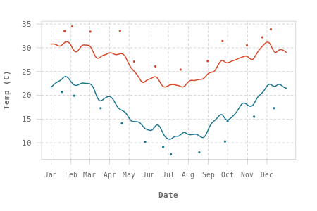

# Brisbane weather graphs in R

A basic rainfall and temperature graph, dragging historical/current data from the Bureau of Meteorology ( http://www.bom.gov.au ) for 2020, though easily adjustable to be used for any available time period.

Results

